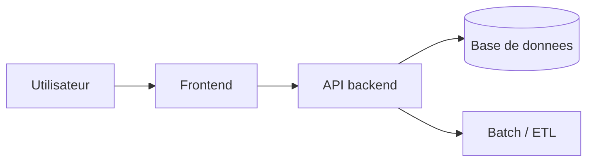

## Template de conception d'architecture

### 1. Vue d’ensemble

- **Contexte** :  
- **Objectif de l’architecture** :  
- **Composants principaux** (frontend, backend, base de données, batch, ETL, etc.) :  

### 2. Schéma d’architecture (exemple en Mermaid)

Adapter ce schéma au projet (composants, flux, protocoles).

### 3. Composants

- **Frontend** :  
  - techno (ex. HTML/JS/Chart.js, framework éventuel) ;  
  - responsabilités ;  
  - dépendances externes.  

- **Backend / API** :  
  - techno (ex. FastAPI, Flask, Spring) ;  
  - principaux endpoints ;  
  - gestion des erreurs, journalisation, monitoring.  

- **Base de données** :  
  - moteur (PostgreSQL, MySQL, etc.) ;  
  - schémas principaux ;  
  - stratégie d’indexation et de performance.  

- **Pipelines / batch** :  
  - flux de données (source → staging → BDD) ;  
  - outils (scripts Python, ETL, planificateur).  

### 4. Non-fonctionnel

- **Disponibilité / résilience** :  
- **Performance / montée en charge** :  
- **Sécurité** (auth, chiffrement, exposition des ports) :  
- **Logs / supervision / alerting** :  

### 5. Références (exemple webapp DVF)

- `conception_ihm_bdd_pipeline.md` (architecture détaillée existante).  
- `webapp-foncier/backend/main.py` (API FastAPI actuelle).  
- `webapp-foncier/frontend/` (IHM Stats et écran de recherche).  

